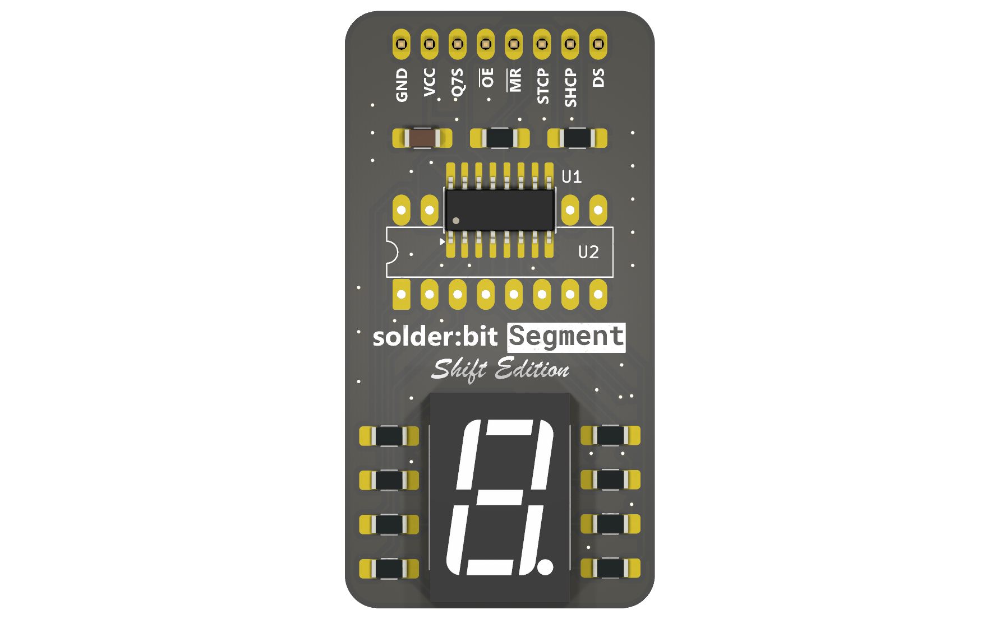
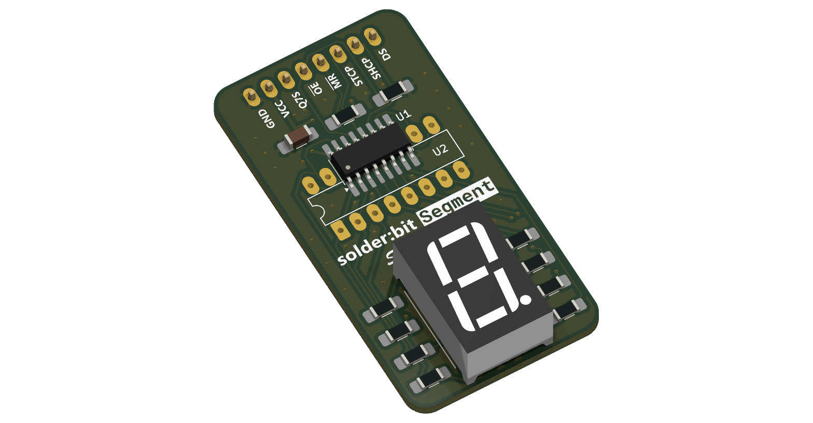
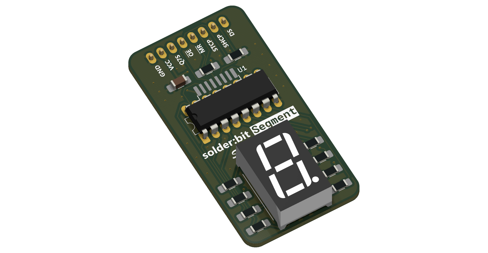
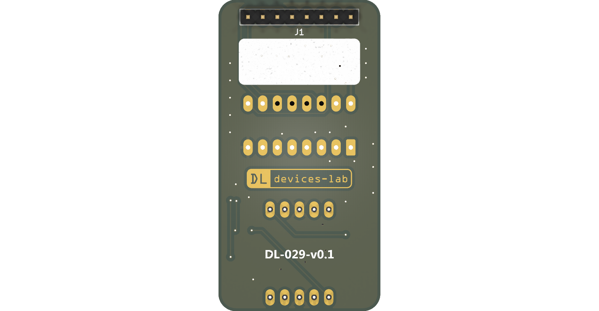

# solder:bit Segment _Shift Edition_

The solder:bit Segment _Shift Edition_ is a variant of the original [solder:bit Segment](https://github.com/devices-lab/solderbit-segment), designed for learning to solder both surface-mount (SMT) and through-hole (THT) components. Once assembled, it can display a single digit on a 7-segment display, driven by an 8-bit serial-in parallel-out (SIPO) shift register.

This soldering kit is designed to accommodate a wide range of soldering abilities. The shift register is available in two different packages. The 74HC595D in the **SOP-16** package is smaller and more challenging to solder, while the SN74HC595N in the **DIP-16** package is larger and through-hole (THT), making it more accessible for novices. The same printed circuit board (PCB) has footprints for both packages, and you choose which component to solder based on your ability. The device functions identically regardless of which package you use. Note that once you have soldered one package, the footprint for the other will no longer be accessible.

| Shift register in an SOP-16 package (SMT) | Shift register in a DIP-16 package (THT) |
| ----------------------------------------- | ---------------------------------------- |
|              |             |

## Getting started

> [!WARNING]
> This device is a research prototype and is provided as-is. Use it at your own risk. The authors take no responsibility for any damage, injury, or loss arising from its use.

To get started, you will need the following:

1. The printed circuit boards (PCBs), which you will need to have manufactured.
2. All components listed in the bill of materials (BOM).
3. A microcontroller development board, like the BBC micro:bit.
4. All equipment and materials required for soldering.

### Printed circuit boards (PCBs)

The solder:bit Segment _Shift Edition_ fabrication files are open source, so you can order the PCBs yourself!

To fabricate the PCB, use the files in the [gerbers-v0.1](/fabrication/gerbers-v0.1/) folder.

### Components

> [!NOTE]
> Most of these components are sourced from [Onecall (Farnell/CPC)](https://onecall.farnell.com/) and [LCSC](https://lcsc.com), but as they are fairly common components, alternatives can be found from other suppliers such as DigiKey and others.

| Reference | Quantity | Part            | Package      | Onecall order code | LCSC part number                                              |
| --------- | -------- | --------------- | ------------ | ------------------ | ------------------------------------------------------------- |
| C1        | 1        | 1 µF \*         | 1206         | 3188966            | [C1848](https://www.lcsc.com/product-detail/C1848.html)       |
| DS1       | 1        | SM420561N \*    | Through Hole | 3648330            | [C141367](https://www.lcsc.com/product-detail/C141367.html)   |
| J1        | 1        | 8-pin header \* | 2.54mm, THT  | 1593416            | [C492407](https://www.lcsc.com/product-detail/C492407.html)   |
| R1, R2    | 2        | 100 kΩ \*       | 1206         | 9241060            | [C17900](https://www.lcsc.com/product-detail/C17900.html)     |
| R3–R10    | 8        | 300 Ω \*        | 1206         | 9240420            | [C17887](https://www.lcsc.com/product-detail/C17887.html)     |
| U1        | 1        | 74HC595D        | SOP-16       | 1201269            | [C5144558](https://www.lcsc.com/product-detail/C5144558.html) |
| U2        | 1        | SN74HC595N      | DIP-16       | 3120865            | [C507175](https://www.lcsc.com/product-detail/C507175.html)   |

_\* Generic component; the order code is provided as a reference, but any equivalent component in the same package can be substituted._

Note that U1 and U2 are alternative packages for the same 74HC595 component — you only need one. You can source both and choose whichever you are more comfortable soldering.

The 7-segment display(s) listed above has red segments. If you would like other colours, note that you might need to adjust R3-R10 resistor values. Also note that you will need a larger resistor value (at least 350 Ω) if you are powering the device with 5 V instead of 3.3 V. This is to ensure the output current from all output pins on the shift register doesn't exceed 70 mA in total.

Depending on how you plan to connect the solder:bit Segment _Shift Edition_ to your microcontroller development board, you may also need a breadboard and some jumper cables.

### Development board

You can use a BBC micro:bit to control the solder:bit Segment _Shift Edition_. Once assembled, attach the device to a breadboard, plug the micro:bit into a [breadboard adaptor](https://kitronik.co.uk/products/5664-microbit-breadboard-breakout-board), and connect it to the breadboard. See the [programming](#programming) section below to see how to wire it up.

> [!CAUTION]
> The device operates at supply voltages (VDD) between 2.1 V and 6 V. When running at 5 V or higher, resistors R3-R10 must be at least 350 Ω to keep the current within safe limits.

The solder:bit Segment _Shift Edition_ can also be used with other microcontroller development boards such as the [Raspberry Pi Pico](https://www.raspberrypi.com/products/raspberry-pi-pico/) or [Arduino Uno](https://store.arduino.cc/products/arduino-uno-rev3), however we currently only provide programming support for the micro:bit.

See the [programming](#programming) section below for how to write code to control the solder:bit Segment _Shift Edition_.

### Equipment and materials for soldering

The required equipment will vary depending on your soldering setup and needs, but the following is what you will generally need:

- Safety goggles
- Fume extractor fan
- Soldering iron
- Soldering iron stand
- Brass wool
- Silicone mat
- Solder
- Tweezers
- Solder wick

The following items are optional but useful:

- Blue Tack (for keeping the PCB in place)
- PCB holder/helping hands
- Flux
- Tip cleaner
- Desoldering pump
- Isopropyl alcohol (IPA) and cotton swabs
- Multimeter (for checking continuity in solder joints)

> [!CAUTION]
> To minimise health hazards, we recommend using lead-free and rosin-free solder and flux.

> [!TIP]
> If you are running this as a workshop/event activity, an [HDMI digital microscope](https://www.amazon.co.uk/dp/B09VPPS96M) connected to a display is very useful for streaming a soldering demonstration to the entire room.

> [!TIP]
> Smaller soldering iron tips make it easier to reach tight spaces, but they transfer heat less effectively. We recommend trying out a few different tip sizes and choosing one that works well with your soldering iron.

## Assembly instructions

Coming soon...

## Programming

If you are using a BBC micro:bit, you can program the solder:bit Segment _Shift Edition_ in [MakeCode](https://makecode.microbit.org/) using the [pxt-solderbit-segment](https://github.com/devices-lab/pxt-solderbit-segment) extension.

You can test if your assembled device works by flashing the micro:bit with the [demo file](/demo/microbit-solderbit-segment-shift-edition-demo.hex). Attach the solder:bit Segment _Shift Edition_ to a breadboard, insert the micro:bit into a [breadboard adaptor](https://kitronik.co.uk/products/5664-microbit-breadboard-breakout-board), and plug it into the breadboard. Connect the device to the micro:bit using the following pinout:

| solder:bit Segment _Shift Edition_ | BBC micro:bit |
| ---------------------------------- | ------------- |
| GND                                | GND           |
| VCC                                | 3V            |
| STCP                               | P2            |
| SHCP                               | P1            |
| DS                                 | P0            |

See [this image](/demo/wiring_front.jpeg) for an example of how to wire it up.

For any other development board, you will need to write the firmware yourself. Refer to the [solder:bit Segment Shift Edition schematic](/reference/solderbit%20Segment%20Shift%20Edition%20v0.1%20schematic.pdf), the datasheets for the I/O expanders (both packages), and the 7-segment display datasheet, all of which are available in the [reference](/reference/) folder.

> [!NOTE]
> The [pxt-solderbit-segment](https://github.com/devices-lab/pxt-solderbit-segment) MakeCode extension handles the original solder:bit Segment as well as this newer solder:bit Segment _Shift Edition_.

## Project status and contributing

This project is actively maintained. See [CHANGELOG.md](/CHANGELOG.md) for the latest changes.

At this time, external contributions are not being accepted. If you have suggestions or have found an issue, feel free to open a GitHub issue and we will take a look.

## Contact

If you are interested in using solder:bit kits for your classroom, university, conference, or any other workshop or event, feel free to reach out to me @mac-aron or contact [Devices Lab](https://devices-lab.org/contact).

## Acknowledgements

Special thanks to everyone at the [Devices Lab](https://www.devices-lab.org/) for their ongoing support on this project and for their help running soldering workshops.

## License

This project is licensed under the GNU General Public License (GPL), version 3. This license allows you to use, modify, and redistribute the solder:bit Segment _Shift Edition_ and any derivative works, but all such derivatives must also be licensed under the GPL.

The GPL ensures that all modifications and improvements to the solder:bit Segment _Shift Edition_ remain free and open for the public benefit. By using this project, you agree to abide by its terms and conditions.

For more details on the license, please see the [LICENSE](/LICENSE) file included in this repository.

